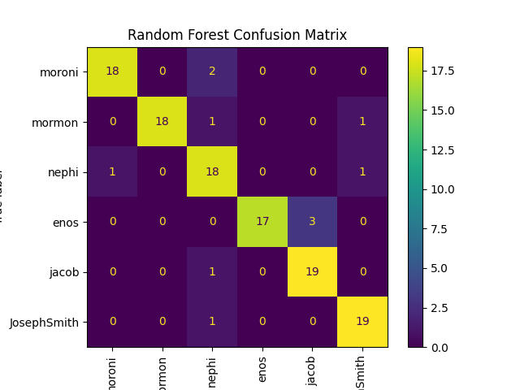
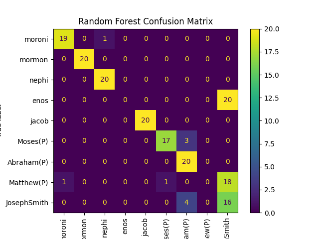

# A Stylometric Analysis of The Book of Mormon
**By: Joseph Allen**

---

# Description
Stylometry is the statistical analysis of variations in literary style between writers. One of the most controversial texts of the 1800's is Joseph Smith's "The Book of Mormon' Joseph Smith's claim regarding the text is that he translated it from an ancient record. He also claims that translation process was done through miraculous means. Looking at The Book of Mormon we see that the text claims multiple unique authorship. Critics would claim a naturalistic approach for The Book of Mormon meaning that Joseph Smith did not have any miraculous means to write The Book of Mormon and instead wrote it through his own abilities and intellect. 

# Purpose
The goal is to use stylometric methods to analyze The Book of Mormon and explore its claims of diverse authorship. Additionally, we aim to compare it to other contemporary texts, including those written by Joseph Smith and his contemporaries, using modern data analysis techniques.

# Scope and Overview
This analysis will cover:
- The Book of Mormon
- Other writings by Joseph Smith (e.g., Doctrine and Covenants, Pearl of Great Price)
- Texts from the same era that critics often claim would be possible sources Joseph Smith used to write The Book of Mormon (The Late War, Spaulding Manuscripts, View of The Hebrews)
- New Testament

Using machine learning and data visualization, we will:
- Compare authorship within The Book of Mormon
- Compare The Book of Mormon to Joseph Smith's other writings
- Compare The Book of Mormon to other 19th-century texts
- Compare The Book of Mormon to the New Testament
- Compare all the text to each other.

We will focus on stylometric variables such as:
- Function words
- Average letters used per word
- Average words used per sentence
- Individual letter usage

The usage of function words provide us some very useful info in determining of authorship. In an article written by Mike Kestemont, "Function Words in Authorship Attribution From Black Magic to Theory?" He provides some useful points as to why function words are useful for this analysis.

- "All authors writing in the same language and period are bound to use the very same function words. Function words are therefore a reliable base for textual comparison;"

- "Their high frequency makes them interesting from a quantitative point of view, since we have many observations for them;"

- "The use of function words is not strongly affected by a text’s topic or genre: the use of the article ‘the’, for instance, is unlikely to be influenced by a text’s topic."

- "The use of function words seems less under an author’s conscious control during the writing process."

- "Recall the last advantage listed above: the argument is often raised that the use of these words would not be under an author’s conscious control during the writing process (Stamatatos, 2009; Binongo, 2003; Argamon and Levitan, 2005; Peng et al., 2003). This would indeed help to explain why function words might act as an author invariant throughout an oeuvre (Koppel et al., 2009, p. 11). Moreover, from a methodological point of view, this would have to be true for forgers and imitators as well, hence, rendering function words resistant to stylistic imitation and forgery." 

Mike Kestemont writes about this idea that function words are used by and author subconsciously, and an author's usage of them can help reveal imitations and forgeries. 

# Methodology
1. **Problem Definition**: Stylometric analysis of The Book of Mormon and other contemporary text.
2. **Data Collection**: Gather texts from The Book of Mormon and other relevant sources.
3. **Data Exploration and Preprocessing**: Prepare the text for analysis.
4. **Data Analysis**: Visualize various stylometric variables.
5. **Modeling**: Train machine learning models to test authorship.
6. **Model Evaluation**: Validate model performance.
7. **Results Communication**: Present findings.

# Data Preprocessing Process

My goal was to extract stylometric variables out of the text according to authorship. This involved first involved gathering all writings and annotating them to their associated authors. From there I was able to divide the writings into subsets based on how much training data I wanted.

For each author grouping of verses, I extracted the following stylometric variables out of the text:

- Individual function word use frequency compared to all words
- Individual function word use frequency compared to all function words.'
- Overall function word use percentage
- Total word count
- Total function word count
- Letter use percentages
- Average letters per word
- Average word per verse

I was able to get all this information to be dynamically created and generated into CSV files.

## Authorship note
For all datasets except The Pearl of Great Price I just went with the traditional authorship. For The Pearl of Great Price since there is some difference in how a text was authored, such as claims of translation to just a dictation of Joseph Smith's words I just had authorship tied to the book it came frame, except for Joseph Smith History and The Articles of Faith which are tied to the authorship "Joseph Smith"

# Modeling

I used four different machine learning models in my analysis. All those models predict categorically meaning that they would guess an author given some data. The models I used are the following:
- Random Forst
- K Nearest Neighbors
- Neural Network
- Ensemble Model

It is also important to note that the Ensemble Model is basically just a combination of the other three models. 

Explaining how each model works is out of the scope of the process, but it is sufficient to say that each model uses different statistical methods to define patterns that it finds in data, and then makes predictions based off those patterns.

The metrics we use to evaluate the model's performance are accuracy, precision, recall, and f1 score. They are defined as:

- Accuracy: The proportion of all predictions (both positive and negative) that were correct.
- Precision: The proportion of predicted positives that were correct.
- Recall: The proportion of actual positives that were correctly identified.
- F1 Score: The harmonic mean of precision and recall, balancing the two.
(Per OpenAI. (2024). ChatGPT conversational AI model.)

While all of these metrics are useful, the most useful metrics for us to look at is accuracy and f1 score.

## Modeling Methods

I created nine different subsets of data containing the following datasets:
- All available datasets
- All available datasets except the New Testament
- The Book of Mormon by itself
- The Book of Mormon and Doctrine & Covenants
- The Book of Mormon and New Testament
- The Book of Mormon, The Late War, Spaulding Manuscript, and The View of The Hebrews
- The Book of Mormon and Pearl of Great Price
- The Doctrine & Covenants, The Late War, Spaulding Manuscript, and The View of The Hebrews
- The New Testament by itself.

# Findings

## **Model Performance**

In terms of performance the models consistently ranked in the order of 

1. Random Forest
2. K Nearest Neighbors
3. Ensemble Model 
4. Neural Network

The models perform quite well when it comes to authors/text that had a higher amount of data. Inversely, the models perform much worse on authors/text that had lower amounts of data. This would be authors such as Enos, Joseph Smith History, Joseph Smith's Revision of Matthew, Articles of Faith, The Book of Moses, James and Peter. Notably, The Pearl of Great Price text was wildly inconsistent, almost getting scores of near 0% accuracy for some authors.

We can view the performance of the models in two ways: through the raw metrics numbers and through a confusion matrix. A confusion matrix shows how each author performed in the model. This is valuable information as it allows us to see how the model is specifically working/messing up. Since the Random Forest model performed the best, we will look at the performance of that model against the different datasets. For interpretation of a confusion matrix a simple way to look at it is the higher the numbers on the diagonal the better.

### *The Book of Mormon Authorship*

- Accuracy: 0.9400
- Precision: 0.9434
- Recall: 0.9400
- F1-Score: 0.9398

As you can see with just predicting within The Book of Mormon the Random Forest model does extremely well at predicting authorship! This supports the idea that the different claimed authors of The Book of Mormon have unique enough writing styles from each other that they can be accurately predicted by a Random Forest Model.

We can see that when including Joseph Smith's writings as found in Doctrine and Covenants, this pattern continues.

- Accuracy: 0.9083
- Precision: 0.9164
- Recall: 0.9083
- F1-Score: 0.9097"

When Doctrine and Covenants is thrown in, the accuracy is still very high, but the accuracy does go down by about 4%. While the different authors do have unique writing styles to still be differentiated, adding in Joseph Smith does seem to bring down the predictive power of model.

What’s interesting to note is that sometimes when other authors are thrown in, the predictive power increases. 

- Accuracy: 0.9688
- Precision: 0.9715
- Recall: 0.9688
- F1-Score: 0.9686

When some other 1800's texts are thrown into the model it seems to help the model differentiate between not only The Book of Mormon authorship and other authors, but even the internal Book of Mormon authorship. This might lead someone to say this supports the idea that Joseph Smith was the sole author of The Book of Mormon since it as a whole gets better predictive power when other texts are introduced, but that idea does not take into account the stronger predictive power that is now found in each author of The Book of Mormon.

Across all the different confusion matrices created The Book of Mormon has close to the same consistent results regardless of other text included in the model. The only author that differs is Enos, which can be accounted for his low amount of text written. We can see The Book of Mormon's consistent performance when comparing it against just The Pearl of Great Price.

- Accuracy: 0.7278
- Precision: 0.6505
- Recall: 0.7278
- F1-Score: 0.6729

As we can see the numeric metrics are not nearly as strong in this data set, but that comes purely from the introduction of The Pearl of Great Price to the model whose poor performance can be blamed on the low amount of data found in that text.

The highest performing dataset was the Doctrine and Covenants, The Late War, the Spaulding Manuscript and The View of The Hebrews.

- Accuracy: 1.0000
- Precision: 1.0000
- Recall: 1.0000
- F1-Score: 1.0000

We can see that the model was able to perfectly predict authorship of these text

Lastly looking at all the data together the confusion matrix shows pretty good results.

- Accuracy: 0.7674
- Precision: 0.7813
- Recall: 0.7674
- F1-Score: 0.7505

The numeric results aren't as strong, but when accounting for some authors that have very little writings the results make more sense.

## **Word Comparisons**

Another way to analyze authorship would be to visualize function word use percentages in a scatterplot. I plot two words at a time as some words have a correlation in usage. Some have no correlation and are simply just a means to showcase more data at once. An important factor to look at is groupings. I divided authorship by color. The Book of Mormon authors are shades of blue, Joseph Smith is black and The Late War, The Spaulding Manuscript and The Late War are red. Some words show tighter groupings between those different authorships and some show no much correlation. Below are a diverse amount of word combinations showing the different correlations:

Graphs based off of other stylometric variables (average letter per word, average words per sentence, vowel usage) also provide some interesting insights

In a good amount of the graphs there seems to be a grouping between The Book of Mormon authors and the other authors. This does seem to lend support towards the idea that The Book of Mormon has a somewhat consistent usage of function words throughout the whole text. Critics of The Book of Mormon could say this is evidence of Joseph Smith being the sole author of The Book of Mormon. Authors of The Book of Mormon do claim that due to the nature of the writing process, as in writing on metal plates, they had to write in a language that they viewed as limited and thus also limits their writing. Whether or not this contributes to the similarities in function word use between The Book of Mormon authorship cannot be concluded, but it is an explanation that someone who holds to the religious view of The Book of Mormon could take. 

## Conclusion
In exploration of authorship of The Book of Mormon and different text we find evidence through stylometric analysis that the claims Joseph Smith and The Book of Mormon itself claim about the authorship of The Book of Mormon may have truth to them. When using machine learning models to learn the patterns of the different authors and then make predictions based off those patterns, a machine learning model can predict accuracy up to high percentage. When looking at function word usage individually we can see that there is some grouping in The Book of Mormon authors in how they use function words, but unique patterns still do present themselves among certain vocabulary. The miraculous claims of authorship regarding The Book of Mormon is not something that can be proven, but by investigating the claims made we can find evidence that does lend to multiple authors of The Book of Mormon.

### References
- [Oxford Languages](https://languages.oup.com/google-dictionary-en)
- [Stylometry Techniques](https://guides.temple.edu/stylometryfordh/methods)
- [The Book Of Mormon Text](https://www.churchofjesuschrist.org/study/scriptures/bofm?lang=eng)
- [Function Word Usage In Determining Authorship Article](https://aclanthology.org/W14-0908.pdf)
---

### Appendicesv
- **Appendix A**: [Jupyter Notebook File Of Data Preprocessing](Data_organizing_transformation.ipynb)
- **Appendix B**: [Jupyter Notebook File Of Machine Learning Process](ML_Model_Usage.ipynb)
- **Appendix C**: [Jupyter Notebook File Of Visualizations Creation (Some also found in Appendix B)](Data_visualizations.ipynb)
- **Appendix D**: [All Visualizations](Graphs)
- **Appendix E**: [All Text](texts)
- **Appendix F**: [All Numeric Metrics](~$metrics_report.xlsx)

